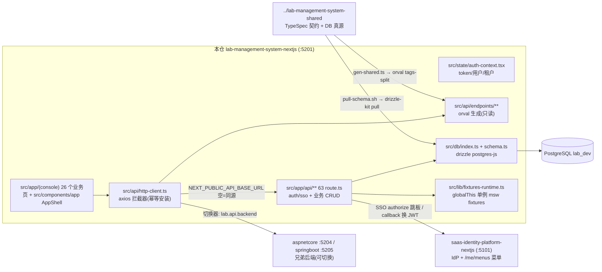
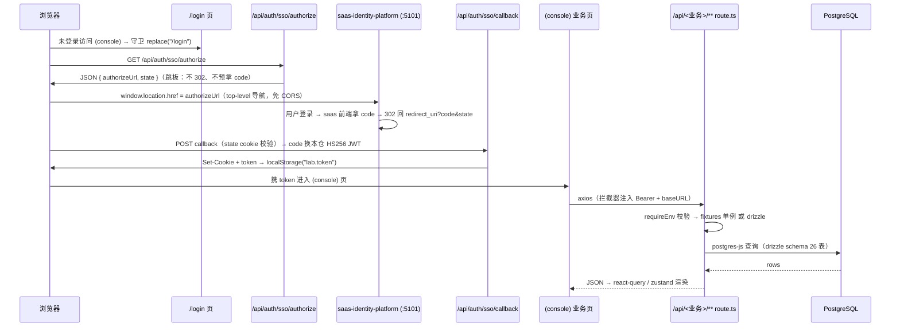

# lab-management-system-nextjs 架构

> 一句话定位：lab-management-system 七仓家族里的 **Next.js 全栈仓**——既是消费 shared 契约产物的前端（App Router SPA 风格控制台），又是「nextjs-self」同源后端（`src/app/api/**` Route Handler 直连 PostgreSQL）；同时是书稿代码块的 source of truth 与 DB-First schema 的 pull/commit 载体。

生成日期：2026-09-22 ｜ 锚定 HEAD：46edac6 ｜ 生成方式：DeepWiki 风格架构扫描

## 1. 总览

- **家族角色**：前端仓（三前端之一）+ 自带后端。同一份产品契约（`../lab-management-system-shared` 的 TypeSpec → OpenAPI）由 react / vue / nextjs 三前端 + aspnetcore / springboot 两后端各自实现；本仓的前端可以通过「后端切换器」把请求指到自身 API routes、aspnetcore（:5204）或 springboot（:5205）。contract-test 仓黑盒校验，e2e 仓做跨端验收。
- **双 app 目录？**：**没有**。本仓只有一个 app 目录 `src/app/`（根目录无 `app/`，已实测确认）。注意这与姊妹仓 saas-identity-platform-nextjs（真双 app 目录）不同。
- **技术栈**（版本钉死于 `version-lock.json`）：Next.js 15 App Router + React 19 + TypeScript 5.7 + Tailwind v4 + drizzle-orm/postgres-js + jose（HS256 JWT）+ orval 7（axios-functions client）+ axios + @tanstack/react-query + zustand。
- **规模速览**（实测）：`src/` 439 个 .ts/.tsx、约 45,300 行；`tests/` 78 个文件、约 12,800 行；API Route Handler 63 个 `route.ts`；`(console)` 路由组 26 个 `page.tsx`；`src/db/schema.ts` 894 行 / 26 张 `pgTable`。

## 2. 系统架构

关键边界解读：

1. **契约只从生成物进**：API 客户端与 DTO 全部来自 `src/api/endpoints/`（orval 产物，整个目录 orval-owned，`clean: true` 防死桩残留）；手写客户端代码只放在 `src/api/` 根（`http-client.ts` / `legacy-client.ts`）。
2. **同源后端**：`NEXT_PUBLIC_API_BASE_URL=""`（默认）时前端 axios 命中本仓 `src/app/api/**`；业务路由的数据源二选一——msw fixtures（进程内 globalThis 单例）或 drizzle + PostgreSQL。
3. **SSO 出口**：本仓不自己管账号身份，OAuth authorize/callback 指向 saas-identity-platform（:5101），callback 换回本仓自签 HS256 JWT。
4. **DB 真源不在本仓**：`src/db/schema.ts` 是 `scripts/pull-schema.sh` 从真库 drizzle-kit pull 的产物，入 git 但禁手改。

## 3. 模块分解

| 模块/目录 | 职责 | 关键文件 |
|---|---|---|
| `src/api/endpoints/` | orval tags-split 生成的 API 客户端，按 shared tsp `@tag` 拆 13 个 tag 目录；schemas 集中在 `model/`；**禁手改，禁混入手写文件** | `contracts/contracts.ts`、`model/` |
| `src/api/`（根） | 手写客户端装配：axios 实例 + 拦截器、后端切换配置、旧路由映射 | `http-client.ts`、`backend-config.ts`、`legacy-client.ts`、`mutator/custom-fetch.ts` |
| `src/app/api/auth/**` | 本仓认证后端：login/logout/me/menus/permissions/refresh/switch-tenant + SSO authorize/callback；JWT 自签（jose HS256） | `auth/sso/authorize/route.ts`（跳板）、`../factory.ts` 消费的 `src/lib/auth/*` |
| `src/app/api/{contracts,receipts,inspection,catalog,samples,test-records,summary,...}/**` | 业务 CRUD Route Handler（63 个 route.ts）；数据源 = fixtures 单例或 drizzle | `receipts/[id]/task/route.ts` 等 |
| `src/app/(console)/**` | 登录后控制台页面（route group，共享壳 layout 统一包 AppShell + 未登录守卫跳 /login）；26 页；`[...path]` catch-all 是未实现业务页的占位（真业务页在 react/vue 仓） | `(console)/layout.tsx`、`(console)/[...path]/page.tsx` |
| `src/components/app/` + `src/components/ui/` | AppShell / SidebarNav / LoginForm / TenantSwitcher 等 + UI 基件 | `app-shell.tsx`、`sidebar-nav.tsx` |
| `src/state/` | 客户端状态：auth-context（token 持久化 + /api/auth/me hydrate）、zustand stores、react-query provider | `auth-context.tsx`、`flowStore.ts`、`query-provider.tsx` |
| `src/db/` | drizzle postgres-js 客户端（`server-only`）+ pull 产物 schema.ts（26 表） | `index.ts`、`schema.ts` |
| `src/lib/` | 服务端共享逻辑：`env-required.ts`（requireEnv fail-fast）、`fixtures-runtime.ts`（globalThis 单例）、auth 工厂、db-queries、act-route | `env-required.ts`、`fixtures-runtime.ts`、`auth/factory.ts` |
| `src/features/` | 领域功能模块：data-entry（含 models 卡片注册表）、receipts、flow/flow-pipeline、reports、summary、task-assignment 等 | `data-entry/models/` |
| `scripts/` | 契约同步（`gen-shared.ts`）、DB-First pull（`pull-schema.sh` + `fix-pulled-schema.mjs`）、seed、pg 借链（`borrow-pg.mjs`） | `gen-shared.ts`、`pull-schema.sh` |
| `vendor/msw/` | `@lab/management-system-msw` file: 依赖（fixtures + 种子数据），next.config 强制 transpile | `vendor/msw/src/` |
| `deploy/` + `Dockerfile` | standalone 镜像（node:24-slim，<200MB）+ VPS 部署脚本 + nginx 配置 | `Dockerfile`、`deploy/docker-entrypoint.sh` |

## 4. 数据流 / 请求生命周期

代表性链路：**用户登录（SSO 跳板）→ 打开业务页 → 数据呈现**。

要点：authorize 端点返回 JSON 而非 302（axios 会 follow 302 触发 CORS）；`installHttpClient` 在 `auth-context.tsx` **模块作用域**安装（子组件 effect 先于父 effect，放 useEffect 会晚于 login 页首请求），幂等实现（先 eject 旧拦截器）防 HMR 叠加——lab-react 踩过的旧闭包覆盖新 token 坑。

## 5. 依赖面

- **对 shared 契约仓**（`../lab-management-system-shared`，dual SSOT）：
  - **API 面**：`npm run gen:shared`（`scripts/gen-shared.ts`）→ shared `npm run emit:openapi` 出 `generated/openapi/openapi.yaml` → 本仓 `npx orval`（tags-split，exclude `frontend-bind-meta` tag）→ `src/api/endpoints/` + prettier 收形；ADR-0026 marker 写 `.state/last-gen-shared.json`（同 sha 零写入）。产物 gitignored（`generated/`）但 `src/api/endpoints/` **入 git**；prebuild 钩子自动重出。
  - **DB 面**：DB-First（ADR-0025/0033）——shared 改 schema → migrate → 本仓 `bash scripts/pull-schema.sh` drizzle-kit pull + `fix-pulled-schema.mjs` 修 TEXT 默认值 → `src/db/schema.ts` 入 git，drift 即信号。
- **对 msw 仓**：`@lab/management-system-msw` file: 依赖（`vendor/msw/`），消费其 fixtures 作为同源后端数据源；跨路由写读必须经 `fixtures-runtime.ts` 的 globalThis 单例（否则各 route bundle 各一份副本 → POST 后 DELETE 404）。
- **对 saas-identity-platform**：IdP（OAuth authorize/token）+ `/me/menus` 菜单来源 + 登录 UI 页；dev 双端点均 :5101。token 不与兄弟 lab 后端互认（各家 JWT key 独立——切换器切换时主动清 token 让会话重走 SSO）。
- **对兄弟后端**：前端可运行时切换到 aspnetcore :5204 / springboot :5205（localStorage `lab.api.backend`，每请求动态读取）；prod 构建剔除这两个选项（无 prod 部署）。
- **外部依赖**：PostgreSQL（远程，`DATABASE_URL` 注入；容器内不持有 DB）；无其他第三方服务。
- **pg 借链**：shared 仓 replay 测试借本仓 node_modules 顶层的 `pg`（`borrow-pg.mjs`）；`pg` 必须留 devDependencies，禁升 dependencies。

## 6. 配置与部署

### env 变量（摘自 `.env.example`；业务/凭据类一律 `requireEnv` fail-fast，缺失即 500——ADR-0019 禁字面兜底）

| key | 用途 | 缺失行为 |
|---|---|---|
| `NEXT_PUBLIC_API_BASE_URL` | 后端 base URL；`""`=同源本仓 API routes | 默认空（同源） |
| `NEXT_PUBLIC_API_MODE` | UI 显示标签（nextjs-self/aspnetcore/springboot） | 默认 `nextjs-self` |
| `SAAS_IDP_URL` / `SAAS_UI_BASE_URL` | saas IdP 端点 / 登录 UI 页（服务端） | requireEnv，缺失 authorize 抛 500 |
| `SAAS_OAUTH_CLIENT_ID` / `SAAS_OAUTH_CLIENT_SECRET` / `SAAS_TENANT_ID` / `SAAS_OAUTH_SCOPE` | OAuth 客户端（client_id = oauth_client 字符串 code，非行 UUID） | requireEnv，缺失 = 502 SSO_AUTHORIZE_UNREACHABLE |
| `NEXT_PUBLIC_SAAS_OAUTH_CLIENT_ID` / `NEXT_PUBLIC_LAB_APP_CODE` | 浏览器侧 client_id + 从 /me/menus 挑本仓菜单的 appCode | 默认 `lab-management` |
| `LAB_SAAS_SERVICE_USER/PASSWORD/CLIENT_ID` | 菜单快照服务账号（密码登录用户拉 /me/menus 用） | requireEnv |
| `LAB_JWT_SECRET/ISSUER/TTL_SECONDS/REFRESH_TTL_SECONDS` | 本仓自签 JWT（注意键名是 LAB_JWT_*，非 JWT_SIGNING_KEY） | dev 有示例值；prod 由 deploy 写入 |
| `LAB_AUTH_DEV_PASSWORD` | dev 登录口令 | requireEnv（login route 必填） |
| `DATABASE_URL` | PostgreSQL 连接串（postgres-js 方言） | 模块顶层 throw（`src/db/index.ts`）；Docker build 用占位 ARG |
| `NEXT_PUBLIC_SAAS_BASE_URL` | 浏览器跨域走 `/api/saas/*` 反代的目标 | 默认 `http://localhost:5101` |

惰性求值约定：route handler 顶层不调 `requireEnv`（`next build` Collecting page data 会崩），运行时首次请求才求值（见 `src/app/api/auth/sso/authorize/route.ts`）。

### 端口 / 构建 / 部署

- **端口**：dev 与 prod 均监听 :5201（lab 家族 520x 段）；VPS nginx 反代到 publish 端口 8022（`deploy/nginx-vps.conf.example`）。
- **构建**：`next.config.ts` 用 `output: "standalone"`（镜像 <200MB）、`serverExternalPackages: ["pg"]`（native binding 不打 bundle）、`transpilePackages: ["@lab/management-system-msw"]`（file: .ts 依赖）、`experimental.typedRoutes: true`。Dockerfile builder 阶段 `git clone` sibling 仓（msw + shared）+ `npm install --install-links`（file: 依赖物理复制，防 symlink 解析断链）；runtime entrypoint 跑 `sync-db.mjs` + 首启 `seed-db.mjs`。
- **部署**：tag 即放行（`v<M>.<m>.
-<YYYYMMDD>`）；`deploy/` 内 VPS setup / deploy 脚本 + docker-entrypoint.sh。

## 7. 质量门禁

来自 `.harness/stack.json`（suite 版本 0.6.0；`source_dirs: src`，`test_dirs: tests`；trace 经 `npx vitest run` + `TRACE_MAP=1`）：

| 门 | 名称 | 命令 |
|---|---|---|
| L1 | 格式 | `npx --no -- prettier --check src tests` |
| L2 | 静态检查 | `npx --no eslint src tests` |
| L3 | 类型 | `npx --no tsc --noEmit` |
| L4 | 测试 | `npx --no vitest run` |

统一入口：suite 根目录 `python scripts/gate.py -p lab-management-system-nextjs`。exit code 语义：**0** = 完成；**1** = 按各门 fix 提示回代码修；**2** = 契约/环境问题，停下问人。注意 L3 禁 `any` / `@ts-ignore` 绕过，L4 先绿再谈重构；测试挂功能 ID 由 trace_cmd 产出 `.state/trace.json`，禁手写。
