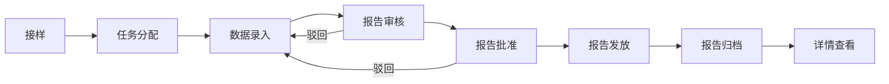
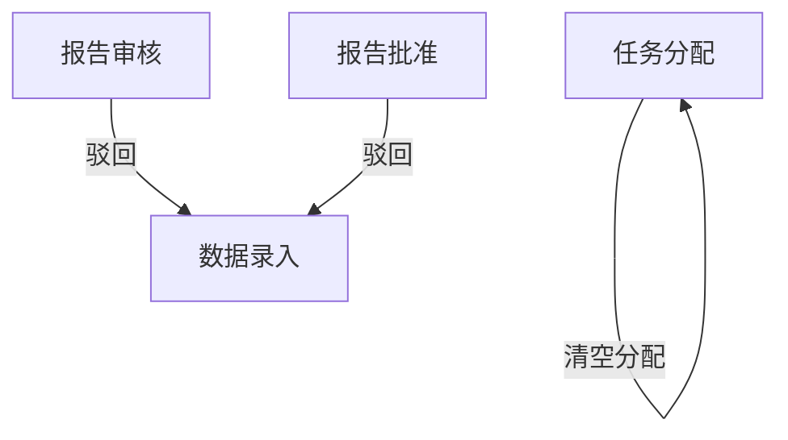

# 流程与功能对齐 — 实验室管理系统-Next.js

> 人填、人评审。机器只检查引用的功能 ID 是否存在。
> 评审时把流程图投出来，逐行念「这一步靠哪些功能完成」。念不出来的行，
> 要么流程是空的，要么功能是缺的。这就是对齐的全部意义。

## FLOW-01 试验过程主流程（接样 → 归档）

| 步骤 | 名称 | 角色 | 输入 | 输出 | 状态流转 | 支撑功能子项 |
|---|---|---|---|---|---|---|
| S01 | 接样 | 接样员 | 委托单 + 样品信息 | sample_receipt + samples | `pending` → `submitted` | M03.F01.I01, M03.F01.I02, M03.F01.I03, M03.F01.I04, M03.F01.I06, M03.F01.I07 |
| S02 | 任务分配 | 任务分配员 | sample_receipt | sample_receipt.assignee/date | `submitted` → `assigned` | M03.F02.I01, M03.F02.I02, M03.F02.I03, M03.F02.I04 |
| S03 | 数据录入 | 检测员 | 样品 + 检测项目 | test_records | `assigned` → `data_entered` | M03.F03.I01, M03.F03.I02, M03.F03.I03, M03.F03.I04, M03.F03.I06, M03.F03.I07 |
| S04 | 报告审核 | 审核员 | sample_receipt + 检测数据 | sample_receipt.flowStatus | `data_entered` → `review_passed` 或 驳回 → `data_entered` | M03.F05.I01, M03.F05.I02, M03.F05.I03, M03.F05.I04 |
| S05 | 报告批准 | 批准人 | sample_receipt | sample_receipt.flowStatus | `review_passed` → `approved` 或 驳回 → `data_entered` | M03.F06.I01, M03.F06.I02, M03.F06.I03, M03.F06.I04 |
| S06 | 报告发放 | 发放员 | sample_receipt | sample_receipt.flowStatus | `approved` → `issued` | M03.F07.I01, M03.F07.I02, M03.F07.I03, M03.F07.I04 |
| S07 | 报告归档 | 档案员 | sample_receipt | sample_receipt.flowStatus | `issued` → `archived` | M03.F08.I01, M03.F08.I02, M03.F08.I03, M03.F08.I04 |
| S08 | 详情查看 | 任意角色 | sample_receipt.id | 完整详情页 | – | M03.F09.I01, M03.F09.I02, M03.F09.I03 |

### 评审时问这四个问题

1. 有没有哪个步骤的「支撑功能子项」是空的？→ 功能缺失，或这一步不该存在
2. 有没有功能子项从头到尾没出现在任何流程里？→ 见下方孤儿清单
3. 状态流转列里的状态名，和代码里的枚举一致吗？→ 不一致就是两套真相
4. 退回路径都画了吗？→ 只画正向流程，会漏掉一半功能

### 孤儿功能

不在任何流程里但合法的功能。**没解释的孤儿 = 没人要的功能。**

| 功能 ID | 为什么合法 |
|---|---|
| M02.F01.I01 | 合同管理是上游资源池，所有接样单通过 contractId 引用；本身不参与流程转换 |
| M02.F01.I02 | 同上（合同新建/编辑） |
| M02.F01.I03 | 同上（合同删除；与试验流程解耦） |
| M98.F01.I01 | 运行时后端切换 UI 下拉，是 infra 切面（选择 msw/aspnetcore/springboot/nextjs 之一） |
| M98.F01.I02 | baseURL 持久化到 localStorage 跨标签同步；infra 状态 |
| M98.F02.I01 | axios 拦截器在 baseURL = getBaseUrl() 上自动跑；infra 副作用，不参与业务流程 |
| M98.F03.I01 | POST /api/auth/login 是 nextjs-backend-mode 下的认证入口；M00 选租户前置 |
| M98.F03.I02 | GET /api/auth/me 给 M00.F01（当前用户会话）提供数据 |
| M98.F03.I03 | POST /api/auth/logout 走侧栏登出按钮（M01.F05.I05） |
| M98.F03.I04 | POST /api/auth/refresh 走 axios 拦截器（M98.F02.I01） |
| M98.F03.I05 | POST /api/auth/switch-tenant 给 M00.F02（登录选租户）提供后端 |
| M05.F01.I01 | 试验报告汇总表：按报告名称（categoryCode）聚合 sample_receipts，是流程末端读视图（不参与状态流转） |
| M06.F05.I01 | 计算规则维护是 M06 字典子域，被数据录入（M03.F03）读取，但本身不参与流程状态 |
| M06.F05.I02 | 同上（计算规则新建/编辑） |
| M06.F05.I03 | 同上（计算规则删除） |
| M06.F06.I01 | 技术要求维护是 M06 字典子域，被数据录入（M03.F03）读取，但本身不参与流程状态 |
| M06.F07.I01 | 报告名称维护是 M06 字典子域，被接样（M03.F01.I07 ext 字段补录）+ 数据录入读取 |
| M06.F07.I02 | 同上（报告名称新建/编辑） |
| M06.F07.I03 | 同上（报告名称删除） |
| M06.F07.I08 | 同上（报告名称扩展属性维护） |
| M04.F06.I01 | 型号码表维护是 M04 基础数据子域，被接样（M03.F01 样品型号下拉）读取，但本身不参与流程状态 |
| M04.F06.I02 | 同上（型号新建/编辑） |
| M04.F06.I03 | 同上（型号删除） |
| M04.F07.I01 | 规格码表维护是 M04 基础数据子域，被接样（M03.F01 样品规格下拉）读取，但本身不参与流程状态 |
| M04.F07.I02 | 同上（规格新建/编辑） |
| M04.F07.I03 | 同上（规格删除） |
| M04.F08.I01 | 等级码表维护是 M04 基础数据子域，被接样（M03.F01 样品等级下拉）读取，但本身不参与流程状态 |
| M04.F08.I02 | 同上（等级新建/编辑） |
| M04.F08.I03 | 同上（等级删除） |
| M04.F09.I01 | 牌号码表维护是 M04 基础数据子域，被接样（M03.F01 样品牌号下拉）读取，但本身不参与流程状态 |
| M04.F09.I02 | 同上（牌号新建/编辑） |
| M04.F09.I03 | 同上（牌号删除） |

---

## FLOW-02 异常流程（驳回 + 撤回）

| 步骤 | 名称 | 角色 | 触发条件 | 操作 | 支撑功能子项 |
|---|---|---|---|---|---|
| A01 | 审核驳回 | 审核员 | 报告数据不合格 | flowStatus → `data_entered`，保留 test_records | M03.F05.I03 |
| A02 | 批准驳回 | 批准人 | 报告签发前需改 | flowStatus → `data_entered`，保留 test_records | M03.F06.I03 |
| A03 | 任务清空 | 任务分配员 | 分配有误 | assignee=null；sample_receipt 保留 | M03.F02.I03 |

### 评审时问这四个问题

1. 有没有哪个步骤的「支撑功能子项」是空的？→ 功能缺失，或这一步不该存在
2. 有没有功能子项从头到尾没出现在任何流程里？→ 见下方孤儿清单
3. 状态流转列里的状态名，和代码里的枚举一致吗？→ 不一致就是两套真相
4. 退回路径都画了吗？→ 只画正向流程，会漏掉一半功能